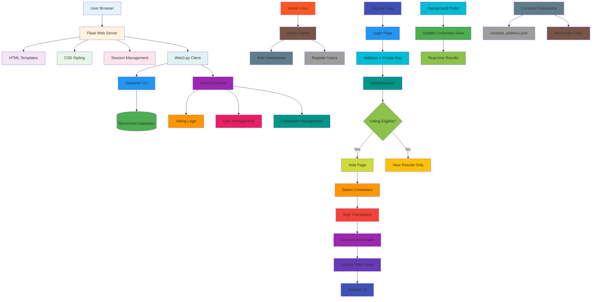

# Decentralized Voting System

A local blockchain-based voting system using Flask web interface and Solidity smart contract. The entire system runs offline on a single PC using a local Ethereum test network (Ganache).

## Team Members

- Syed Suhail - 220071601263
- Tharagaraman B - 220071601264
- Ujjual Menon NP - 220071601267
- Vjaylakshman K - 220071601270
- Zuhair - 220071601273

## Features

- Offline blockchain voting system
- Admin panel for user registration and contestant management
- User authentication via Ethereum addresses and private keys
- Live vote tally updates via background polling
- Secure transactions signed with private keys
- **Persistent voting data** - votes survive server restarts

## System Architecture



### How It Works

1. **Setup Phase**: Ganache blockchain starts with persistent storage
2. **Contract Deployment**: Voting smart contract is deployed and saved
3. **Admin Setup**: Admin adds contestants and registers voters
4. **User Voting**: Users authenticate and cast votes via signed transactions
5. **Real-time Updates**: Background polling keeps vote tallies current
6. **Persistence**: Votes survive server restarts through blockchain storage

## Requirements

- Python 3.10+
- Ganache CLI or Hardhat local node
- Node.js and npm (for Ganache if needed)

## Installation

1. Clone the repository and navigate to the project directory.

2. Create and activate a virtual environment:
   ```bash
   python -m venv .venv
   source .venv/bin/activate  # On Windows: .venv\Scripts\activate
   ```

3. Install dependencies:
   ```bash
   pip install -r requirements.txt
   ```

4. Install Solidity compiler:
   ```bash
   pip install py-solc-x
   ```

## Setup

1. **Copy environment template** (first time only):
   ```bash
   cp .env.example .env
   ```

2. Start the local blockchain with **persistent storage**:
   ```bash
   # Option 1: Manual setup
   mkdir -p ganache-db
   ganache-cli --db ganache-db --deterministic

   # Option 2: Use the provided script (recommended)
   ./start-ganache.sh
   ```
   **Important**: The `--db ganache-db` flag saves all blockchain state to disk. Your contracts and votes will persist between restarts!

3. Start the Flask server:
   ```bash
   python main.py
   ```
   - On first run: Contract will be deployed and saved to `contract_address.json`
   - On subsequent runs: Existing contract will be loaded from `contract_address.json`

4. Access the application at `http://127.0.0.1:5000`.

## Data Persistence

**Your votes persist at TWO levels!** 🎉

### Level 1: Blockchain Persistence (Recommended)
- **Ganache with database**: Use `ganache-cli --db ganache-db --deterministic`
- All contracts, transactions, and votes are saved to disk
- Survives computer restarts, power outages, etc.
- **True blockchain persistence** - your voting data lives forever

### Level 2: File Persistence (Fallback)
- Contract information stored in `contract_address.json`
- Votes persist between server restarts (but not blockchain restarts)
- Automatic fallback when blockchain state is lost

### How to Enable Full Persistence

1. **Create database directory**:
   ```bash
   mkdir -p ganache-db
   ```

2. **Start Ganache with persistence**:
   ```bash
   ganache-cli --db ganache-db --deterministic
   ```

3. **Your votes will now persist forever!** ✨
   - Stop and restart Ganache anytime
   - Reboot your computer
   - Your voting data remains intact

### Without Persistence (Current Default)
```bash
ganache-cli --deterministic  # No --db flag = in-memory only
```
- All data lost when Ganache stops
- Fresh contract deployed each time
- Good for testing, bad for real voting

## Usage

- **Admin Login**: Use the first Ganache account address and its private key.
- **User Login**: Users need to be registered by admin first, then login with their address and private key.
- **Voting**: Users can vote once for a contestant.
- **Admin Panel**: Add contestants and register users.

## File Structure

```
project_root/
│
├── main.py                 # Flask application
├── contract_address.json   # Contract persistence (auto-generated)
├── start-ganache.sh        # Script to start Ganache with persistence
├── ganache-db/             # Blockchain database (created by start-ganache.sh)
├── contracts/
│   └── Voting.sol          # Solidity smart contract
├── static/
│   └── main.css            # CSS styles
├── templates/
│   ├── base.html           # Base template
│   ├── index.html          # Vote tally page
│   ├── admin.html          # Admin panel
│   ├── login.html          # Login page
│   └── vote.html           # Voting page
├── requirements.txt        # Python dependencies
├── pyproject.toml          # Project configuration
└── README.md               # This file
```

## Security Note

This is a demonstration project. In a real-world scenario, private keys should never be stored in sessions or handled insecurely. Use hardware wallets or secure key management for production.

The `contract_address.json` file contains contract information - keep it secure and never commit it to version control if it contains sensitive data.

## License

This project is licensed under the MIT License - see the [LICENSE](LICENSE) file for details.
